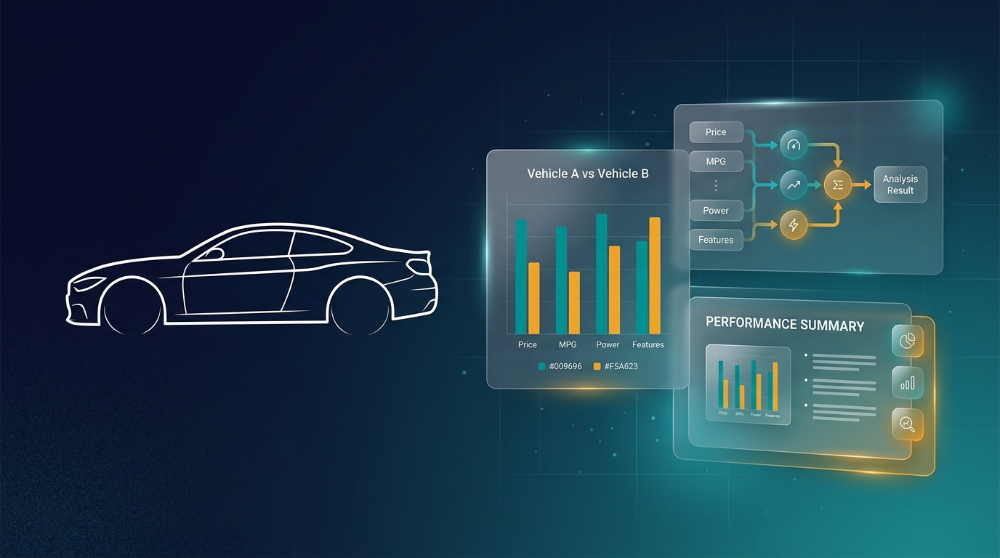
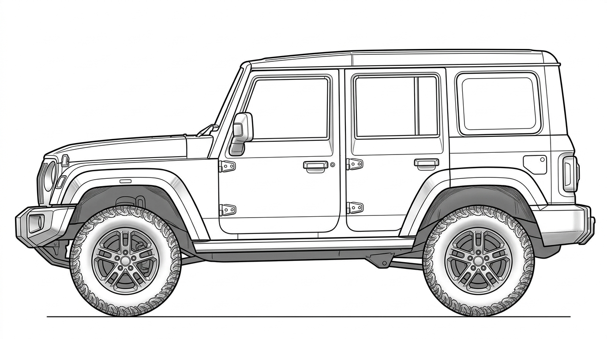
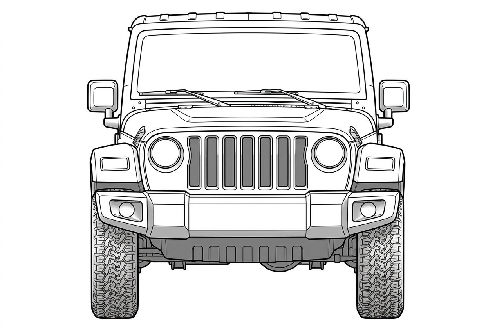
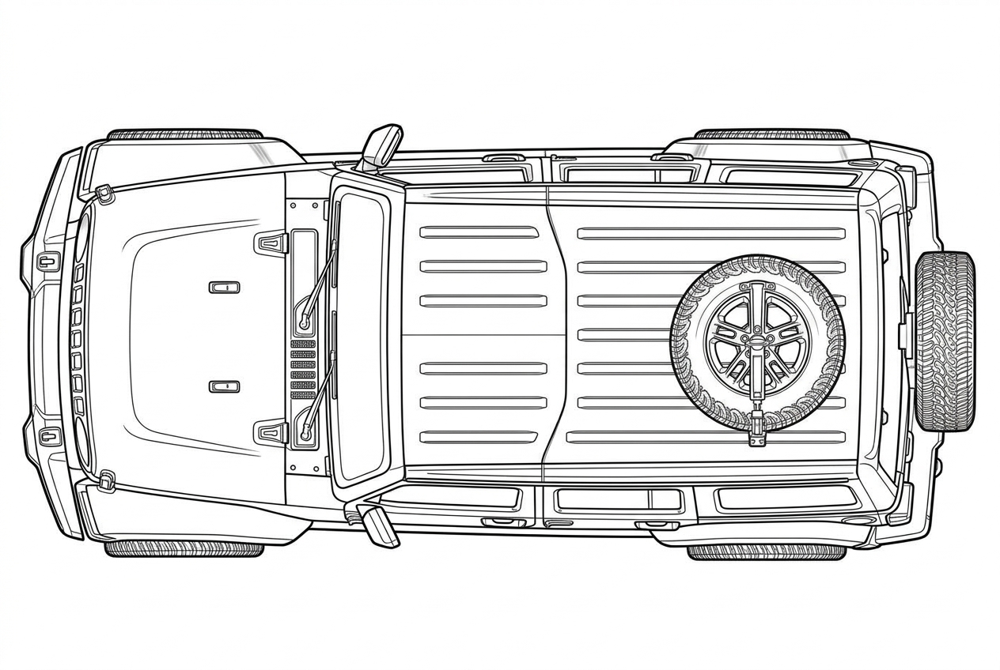
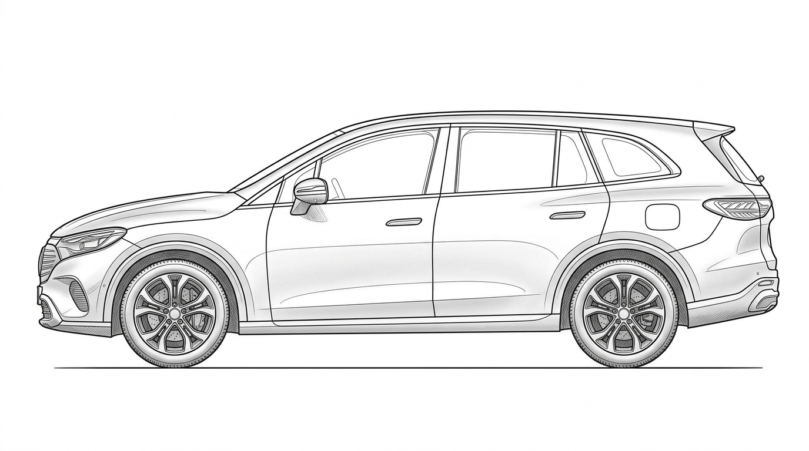
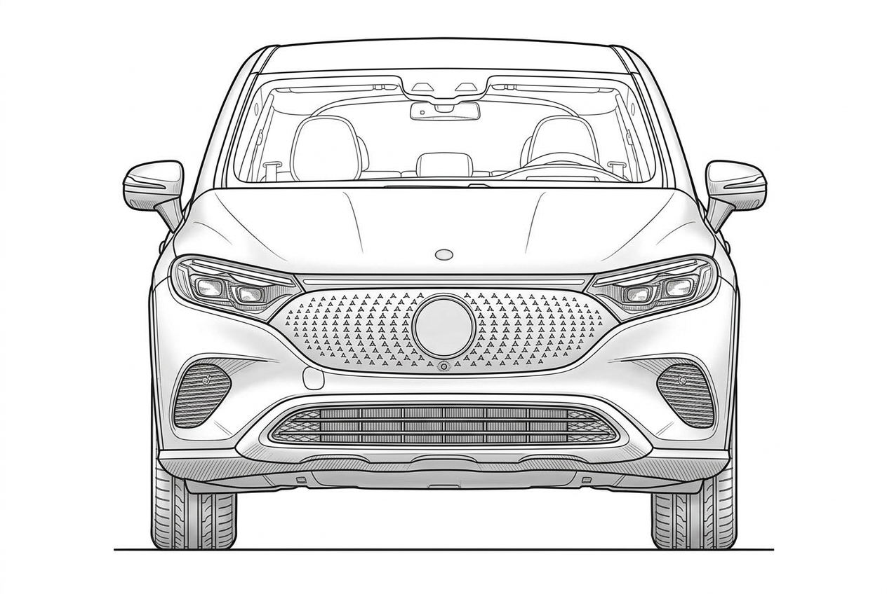
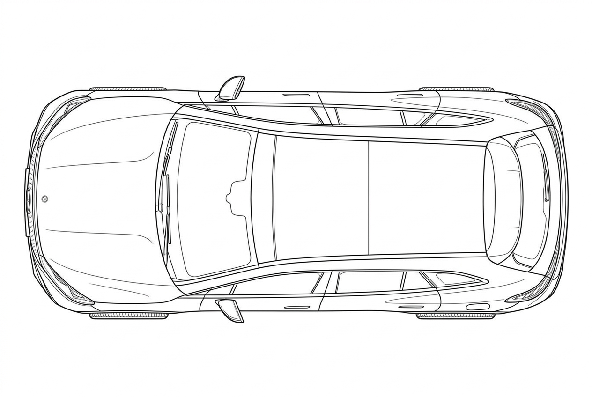
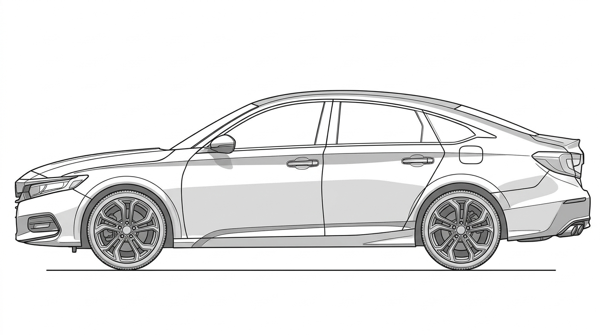
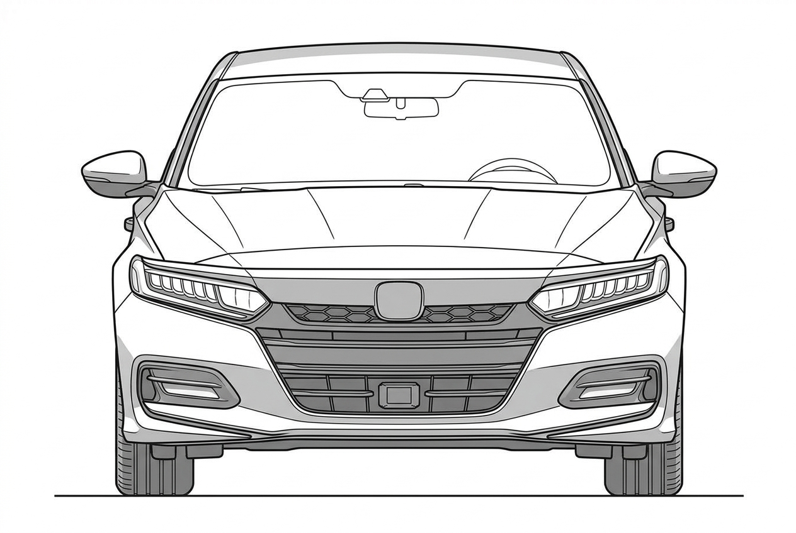
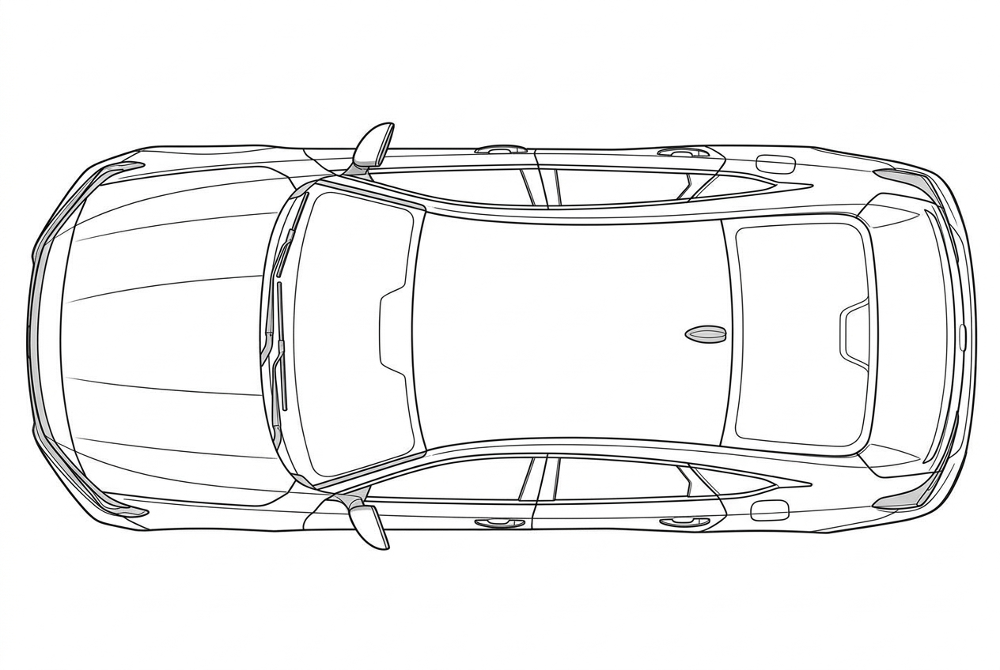

<p align="center">
  
</p>

<h1 align="center">🚗 AutoMetrics Pro</h1>
<h3 align="center">Automated Car Metrics Comparison & PowerPoint Generator</h3>

<p align="center">
  
  
  
  
</p>

<p align="center">
  <b>Turn raw car metrics data into professional, presentation-ready PowerPoint slides — automatically.</b><br>
  Built for Advance Vehicle Architecture teams to compare vehicles across multiple dimensions with annotated 2D diagrams, bar charts, and ranking tables.
</p>

---

## ✨ What It Does

AutoMetrics Pro takes car specification data from an Excel sheet and generates a **complete PowerPoint presentation** with:

- 📐 **Annotated 2D car diagrams** — arrows showing where each metric (length, height, wheelbase, etc.) is measured on the vehicle
- 📊 **Color-coded bar charts** — master car highlighted in amber, benchmarks in gray, sorted by value
- 📋 **Difference/ranking tables** — cars ranked ascending with delta values between consecutive entries
- 🎨 **Professional styling** — teal title bars, consistent typography, slide numbers, corporate-ready design

### Multi-View & Multi-Type Support

The system supports **3 car body types** (Boxy, Curvy, Coupe) and **3 camera views** (Side, Front, Top):

| | Side View | Front View | Top View |
|---|---|---|---|
| **Boxy** (Off-road SUVs) |  |  |  |
| **Curvy** (Crossovers) |  |  |  |
| **Coupe** (Sedans) |  |  |  |

When you select a master car, the system **automatically picks the correct car type images** for all slides. Change the master car → all slides update to the new type's views.

---

## 🏗️ Architecture

```
AutoMetrics Pro
├── data/
│   ├── car_metrics.xlsx        # Car data + metric config (input)
│   └── images/                 # 2D car diagrams (side/front/top × boxy/curvy/coupe)
├── config/
│   └── arrow_config.json       # Arrow annotations per metric per view
├── arrow_editor/               # Flask web app for visual arrow configuration
│   ├── app.py                  # Backend API (metrics, arrows, image resolution)
│   ├── static/editor.js        # Interactive canvas with click-to-place arrows
│   └── templates/editor.html   # Editor UI
├── generate_ppt.py             # Main PPT generator engine
├── output/                     # Generated .pptx files
├── run_generator.bat           # One-click PPT generation
├── run_arrow_editor.bat        # One-click arrow editor launch
└── USER_GUIDE.md               # Comprehensive user guide
```

---

## 🚀 Quick Start

### Prerequisites

- Python 3.8 or higher
- pip (Python package manager)

### Installation

```bash
# Clone the repository
git clone https://github.com/YOUR_USERNAME/autometrics-pro.git
cd autometrics-pro

# Install dependencies
pip install -r requirements.txt
```

### Generate a Presentation

```bash
# Option 1: Run the script directly
python generate_ppt.py

# Option 2: Double-click run_generator.bat (Windows)
```

The generated `.pptx` file will be saved in the `output/` folder.

### Configure Arrow Annotations

```bash
# Option 1: Run the Flask app
python arrow_editor/app.py

# Option 2: Double-click run_arrow_editor.bat (Windows)
```

Then open **http://localhost:5000** in your browser. Click on metrics, place arrows visually, and save.

---

## 📊 How It Works

### 1. Data Input (Excel)

The `data/car_metrics.xlsx` file contains two sheets:

**Car Data** — Your vehicle specifications:
| Select | Car Name | Type | Overall Length (mm) | Wheelbase (mm) | ... |
|--------|----------|------|---------------------|-----------------|-----|
| YES | XEV 9e | Coupe Master | 4790 | 2775 | ... |
| Y | Thar Roxx | Boxy Master | 4428 | 2850 | ... |
| Y | Creta | Benchmark | 4330 | 2610 | ... |

- `YES` = Master car (highlighted in amber in charts)
- `Y` = Comparison/benchmark car (gray in charts)
- `Type` = Car classification (`Boxy Master`, `Curvy Master`, `Coupe Master`, `Benchmark`)

**Metric Config** — Display names, units, and default images for each metric.

### 2. Arrow Editor (Visual Tool)

A browser-based tool to visually place measurement arrows on car diagrams:

- **Multi-view support** — Configure arrows on Side, Front, or Top views independently
- **Per-view coordinates** — Each view has its own arrow positions (a "Width" arrow looks different on a front view vs. top view)
- **Auto image resolution** — Shows the correct car type image based on the master car in Excel
- **View status panel** — See at a glance which views are configured for each metric

### 3. PPT Generation

Each metric gets a dedicated slide containing:
- **Annotated car diagram** — the correct view (side/front/top) of the correct car type, with arrow overlay
- **Bar chart** — master car in amber, benchmarks in gray, value labels on top
- **Ranking table** — sorted ascending with delta values

The generator automatically:
- Reads `view_type` from the arrow config to determine which view each slide needs
- Resolves `master_car_type + view_type` → correct image file (e.g., `curvy_front_view.png`)
- Uses the arrow coordinates specific to that view

---

## 🔧 Configuration

### Arrow Config Format

Each metric in `config/arrow_config.json` supports per-view arrow configurations:

```json
{
  "Overall Width (mm)": {
    "view_type": "front_view",
    "side_view": {
      "start": [0.35, 0.7],
      "end": [0.65, 0.7],
      "label": "Overall Width",
      "color": "#2F5496"
    },
    "front_view": {
      "start": [0.1, 0.5],
      "end": [0.9, 0.5],
      "label": "Overall Width",
      "color": "#2F5496"
    }
  }
}
```

- `view_type` — which view the PPT slide will render
- Each view key (`side_view`, `front_view`, `top_view`) contains independent arrow coordinates

### Adding Custom Car Types

1. Create `{type}_side_view.png`, `{type}_front_view.png`, `{type}_top_view.png` in `data/images/`
2. Add the type mapping in `generate_ppt.py` → `TYPE_VIEW_IMAGE_MAP`
3. Add the type in your Excel data under the `Type` column

---

## 🛠️ Tech Stack

| Component | Technology |
|-----------|-----------|
| PPT Generation | `python-pptx` |
| Charts | `matplotlib` |
| Image Annotation | `Pillow (PIL)` |
| Excel Parsing | `openpyxl` |
| Arrow Editor | `Flask` + vanilla JS + HTML5 Canvas |

---

## 📁 Output

Each run generates a timestamped `.pptx` file:

```
output/Car_Comparison_2026-09-17_235420.pptx
```

Contains:
- 1 title slide with car groupings and master car highlight
- N metric slides (one per metric in your Excel data)

---

## 🤝 Contributing

Contributions are welcome! Here are some ideas:

- 🎨 Add new car body type silhouettes
- 📊 Add new chart types (radar, scatter)
- 🌍 Multi-language support for labels
- 📱 Make the arrow editor mobile-responsive
- 🔌 Add export to PDF

---

## 📄 License

This project is licensed under the MIT License — see the [LICENSE](LICENSE) file for details.

---

<p align="center">
  <b>Built with ❤️ for the automotive engineering community</b><br>
  <i>Making vehicle comparison presentations effortless</i>
</p>
